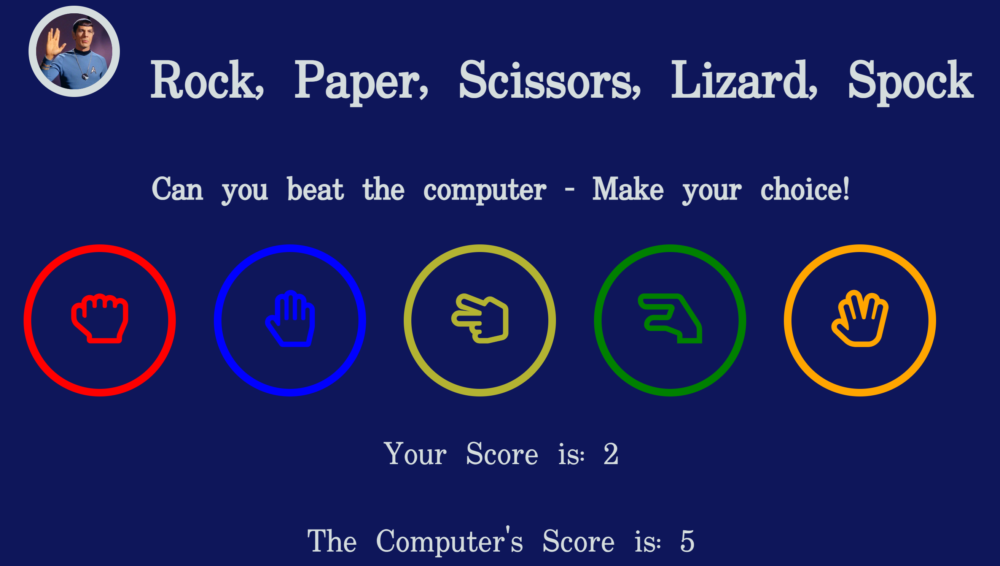

# Rock, Paper, Scissors, Lizard, Spock Game!

[Please view my live project here!](https://markreddy87.github.io/Rock-Paper-Scissors-Lizard-Spock-Game-Project-2-/)

## 1. Purpose of the project
This project was both exciting and scary for me at the same time! I was very eager to build my very first web based game and the thought of being able to do this truely excited me. On the other hand the task became quite daunting as it was essential that I had completly grasped the essential basic concepts of the JavaScript language, something which I have struggled with up to now. With that being said, I managed to get the project where I wanted it to be and I am already looking forward to the next one!

I wanted this project to be a fun and easy going gaming experience for any user that came to the page. It consists of a fairly simple game called Rock, Paper, Scissors, Lizard, Spock! It is a slight twist on the original Rock, Paper, Scissors game with two extra parameters. The user makes their choice and play's against the computer in this game of chance and can see how well they are doing from the incrementing wins and losses displayed at the bottom of the page. 

The rules of the game are as follows: Rock crushes Scissors, Rock crushes Lizard, Paper covers Rock, Paper disproves Spock, Scissors cuts Paper, Scissors decapitates Lizard, Spock vaporizes Rock, Spock smashes Scissors, Lizard eats paper and Lizard poisons Spock! 

## 2. user stories

## 3. Features

This project is a single page website and is designed to be a self contained game which the user knows how to play immediatly. 

Once the page has been loaded the user attention is immediatly draw to the image of spock (leonard Nimoy) in the top left corner. The image will encourage a positive emotional response as Spock is such a recognizable hero from the Star Trek T.V. show and films. The user will then read the text (h1) which tells them what game they are playing. The text below the title challanges them to play against the computer and asks them to make their choice. 

The buttons are designed with bold eye catching icons and have been styled to match the heading image. 

Once a button is clicked the user has made their choice and an alert will appear letting them know what they have chosen.

 Once the above alert is closed the program will then choose a random option from an array of choices and another alert will appear telling the user what the computers choice is and if they have won, lost or if there has been a draw. 

 

The user's score is updated accordingly at the bottom of the page once the second alert has been closed. 

The game is now ready to play again! What is your high score??

## 4. future features

## 5. Typography and color scheme

## 6. wireframes

## 7. technology

## 8. testing
   ### 8.1 code validation
   ### 8.2 test cases (user story based with screenshots)
   ### 8.3 fixed bugs
   ### 8.4 supported screens and browsers

## 9. Deployment
   ### 9.1 via gitpod
   ### 9.2 via github pages
   [Please view my live project here!](https://markreddy87.github.io/Rock-Paper-Scissors-Lizard-Spock-Game-Project-2-/)

## 10. credits